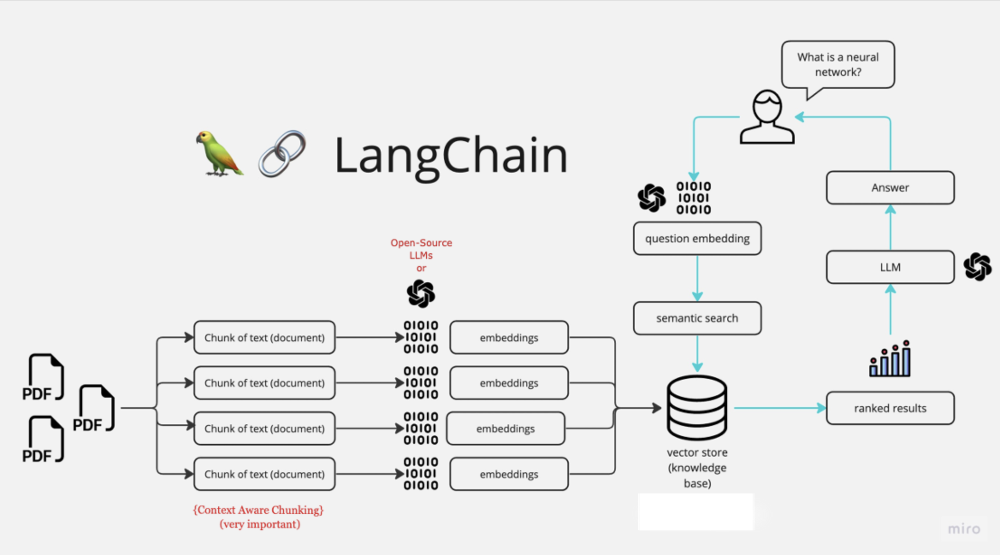

<p align="center">
  
</p>

## Introduction

Ask-your-PDFs is a Python application that leverages Retrieval-Augmented Generation (RAG) using LangChain. This application enables users to interactively ask questions about the content of PDF documents and receive informative responses generated based on the retrieved information.

## Architecture



## Demo
<a href="https://huggingface.co/spaces/akarshrajsingh7/Ask-Your-PDFs"> Application Demo </a>

This demo is using **open source model** (not OpenAI API) and hosted on the **free basic CPU machine**. So expect below things-
1) Slow processing time
2) Inaccurate results (since the model is not capable to generate chatgpt like outputs)

## Features

- **Retrieval-Augmented Generation:** Utilizes the power of RAG to enhance the generation of responses by retrieving relevant information from PDF documents.

- **Interactive Questioning (Chat UI):** Users can ask questions in natural language, and the application will provide detailed and contextually relevant answers. Previous questions in the same session will also be visible

- **Multiple PDFs support** : You can upload one or more files and ask questions on them collectively

- **Open Source LLM support** : The demo link above is using the open source LLM for generating the answer

## Getting Started

Follow these steps to get started with Ask-your-PDFs:

1. **Clone the Repository:**
   ```bash
   git clone https://github.com/akarshrajsingh7/Ask-Your-PDFs.git
   cd Ask-Your-PDFs
   ```

2. **Install Dependencies:**
   ```bash
   pip install -r requirements.txt
   ```

3. **Run the Application:**
   ```bash
   streamlit run app.py
   ```

   The application will prompt you to input the path to the PDF document you want to query.

4. **Ask Questions:**
   Once the document is loaded, you can start asking questions in a chat UI with memory of chats in the same session. The application will provide responses based on both generation and retrieval techniques.


## Contributing

We welcome contributions from the community! If you find issues or have ideas for improvements, please open an issue or submit a pull request.

## License

This project is licensed under the [MIT License](LICENSE).
